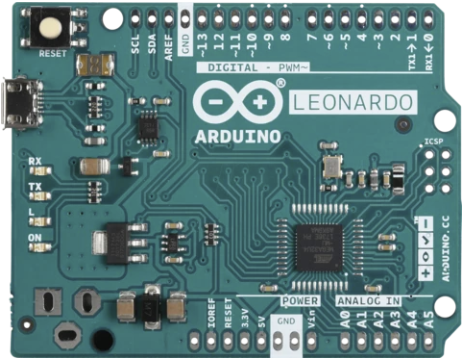
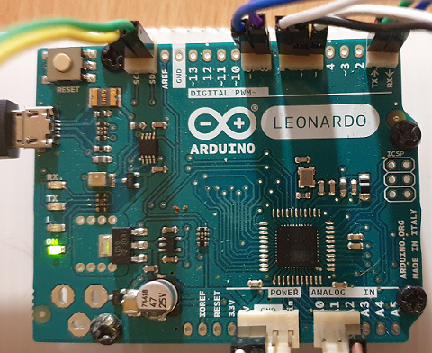

# **Arduino setup**

## **Contents**

- [Hardware](#Hardware)
- [Code files](#Code-files)
- [Configuration](#Configuration)

## **Hardware**

For efficiency and convenience we use an Arduino Leonardo without headers.
The goal is to have it running the appropriate code and have it interface to sensors, a servo, a digital relay and the Raspberry PI. All these connections are made to the Vero board that links everything.

The main limitations with the Leonardo as compared to the more powerful MEGA is that it has only one usable interrupt pin (D7). Its data memory is also less, so some tricks had to be used to reduce global data usage. Luckily it has two hardware serial ports (with one usable) which ruled out the less powerful Nano.

In production it is powered by the Raspberry PI with a USB A male to Micro-B Cable. For programming this can be connected to a PC. The other connections are via various pads (detailed below) to which appropriate straight locking headers are soldered.

* 4 Pin 0.1 Straight Locking Header
  * 5V - supplies power to the Vero board
  * GND - connects to common ground on Vero board
  * GND - Not connected
  * Vin - Not connected  
* 3 Pin 0.1 Straight Locking Header
  * A0 - Not connected
  * A1 - Not connected
  * A2 - Wind Vane
* 2 Pin 0.1 Straight Locking Header
  * SCL - for I2C sensors
  * SCA - for I2C sensors
* 2 Pin 0.1 Straight Locking Header
  * D9 - Anemometer interrupt flag
  * D8 - Rain guage interrupt flag
* 3 Pin 0.1 Straight Locking Header
  * D7 - Common interrupt (only one available)
  * D6 - PWM for conrolling servo
  * D5 - For controlling Relay
* 2 Pin 0.1 Straight Locking Header
  * TX-> - serial comms with Raspberry PI
  * RX<- - serial comms with Raspberry PI





## **Code files**

 File | Description |
| --- | --- |
| [ArduinoLeonardo.ino](ArduinoLeonardo/ArduinoLeonardo.ino) | the c++ program that runs on the Arduino |
| [Adafruit Unified Sensor](https://github.com/adafruit/Adafruit_Sensor) | Third party Library |
| [Adafruit BME280 Library](https://github.com/adafruit/Adafruit_BME280_Library) | Third party library |
| [Adafruit INA260 Library](https://github.com/adafruit/Adafruit_INA260) | Third party library |

No setup of software for the Leonardo is necessary apart from just compiling and loading the above ```ArduinoLeonardo.ino``` file onto it. This can be done in the well documented [Arduino IDE](https://www.arduino.cc/en/Main/Software).

To successfully compile you will also need to download the three third party libraries shown above.

## **Configuration**

If debuging/examining the code you will need to compile with the ```# DEBUG TRUE``` flag and then use the *Tools => Serial Monitor* window to examine/confirm that the program is running correctly. In that case the Arduino is powered from the PC's USB port that is also used for programming.

In production comment out the above flag ie. compile with ```//# DEBUG TRUE```. In that case you must after programming restart the software while powering the Arduino from the Raspberry PI.
