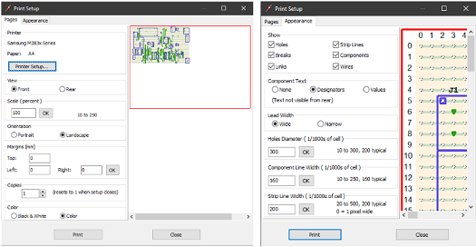
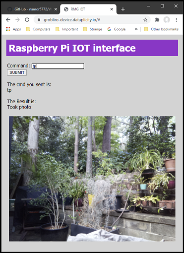

# Weather Station

## **Contents**

- [Summary](#Summary)
- [Setup Raspberry PI](#Setup-Raspberry-PI)
- [Setup Arduino](#Setup-Arduino)
- [Design circuit board](#Design-circuit-board)
  - [Install TinyCAD](#Install-TinyCAD)
  - [Install VeeCAD](#Install-VeeCAD)
- [Assemble weather station](#Assemble-weather-station)
  - [Build circuit board](#Build-circuit-board)
  - [Assemble electronics](#Assemble-electronics)
  - [Attach BME280 sensors](#Attach-BME280-sensor)
  - [Attach wind and rain gauges](#Attach-wind-and-rain-gauges)
  - [Attach wifi interface](#Attach-wifi-interface)
  - [Attach camera](#Attach-camera)
  - [Attach power](#Attach-power)  
- [Use weather station](#Use-weather-station)
  - [Access web interface](#Access-web-interface)
  - [Automate data collection](#Automate-data-collection)
- [List of parts](#List-of-parts)
  - [Core components](#Core-components)
  - [Connectors](#Connectors)
  - [External components](#External-components)


## Summary


This document describes the design, building and programming of an IOT enabled weather station. At regular intervals (eg. every 15 minutes) it measures a range of weather and other statistics, saving them as time stamped rows to an updated csv file. In particular:

1. Temperature (C)
1. Pressure (HPa)
1. Humidity (%)
1. Rainfall (mm/h)
1. Wind speed (km/h)
1. Wind direction (deg)
1. CPU temp (C) - of the Raspberry Pi
1. Current (A) - being drawn from the solar panel charged battery
1. Voltage (V) - at the inputs to the circuits voltage regulator
1. Power (W) - drawn by the weather station ( as A*V above)

This data can be remotely accessed via a php nginx web server interface from the Raspberry Pi, which also enables add-hoc contol and data requests. There is also a camera (attached to the Raspberry Pi) which can be controlled to take pictures on demand.

The hardware is based on a Raspberry Pi 3A+ and an Arduino Leonardo together with a Vero strip board that contains the Voltage Regulator and all other "glue" circuits. Everything is powered by a 12V 100Ah AGM Deep Cycle Battery which is charged by a 12V 150W Solar panel via a PWM Solar charge controller. The 12V input is regulated to 5.2V for the Raspberry Pi. This is is also used as required for charging the wifi modem, powering the Arduino (from the Raspberry Pi), powering sensors, servos and the digital relay.

The Raspberry Pi runs the web server and a python program that operates a bi-directional serial communications channel with the Arduino. The latter is ultimately attached to the various weather sensors. It also controls the digital relay used to time the charging of the wifi modem (on a 12hrs overnight ON and 12hr daytime OFF cycle) and the servo used to reset it (either by explicit command or each midnight). Control messages are typically sent from the Raspberry Pi via the serial channel to the Arduino (running a C++ program) which then returns sensor results or performs requested actions and returns confirmation messages.

The wifi modem and servo are attched by loomed 2 metre cables to the Vero board. The temperatue, pressure and humidity sensor is similarily attached with 1 metre cables. The two RJ11 terminated 3 metre cables from the rainfall, windspeed and wind direction sensors also attach to the Vero board. The Vero board circuit logic was designed in TinyCAD and its layout in VeeCAD.

## Setup Raspberry PI

We are using a Raspberry Pi 3 Model A+.

Details on how to set it up are given [**HERE**](RaspberryPI/README.md).

## Setup Arduino

We are using a Arduino Leonardo (Without Headers).

Details on how to set it up are given [**HERE**](Arduino/README.md).

## Design circuit board

### Install TinyCAD

[**DOWNLOAD**](https://www.tinycad.net/Home/Download) and install TinyCAD if you don't already have it.

In addition we need the following files. They can reside in any directories (on the PC where TinyCAD is installed) when copied from here or recreated.

| File | Description |
| --- | --- |
| [V_RomansOwn2020.TCLib](data/V_RomansOwn2020.TCLib) | TinyCAD library file with needed custom symbols |
| [WeatherStationMain1.dsn](data/WeatherStationMain1.dsn) | Actual TinyCAD file for this projects circuit board |
| [WeatherStationMain1.net](data/WeatherStationMain1.net) | PCB netlist created in Protel format from above file |

Now install the above custom symbol library **V_RomansOwn2020.TCLib** from the main menu of TinyCAD: **Library=>Libraries..=>Add=>V_RomansOwn2020.TCLib=>Open=>Ok**


Finally we assume that all the generic TinyCAD and VeeCAD symbols libraries are installed and now we can open and view **WeatherStationMain1.dsn** with TinyCAD:


With the above *.dsn file loaded we can check and recreate (if we want to) the Protel netlist file **WeatherStationMain1.net** (mentioned above). To avoid warnings filter the checking options as follows:


Use **Special=>Create PCB Net List...=>Export**


### Install VeeCAD

[**DOWNLOAD**](https://veecad.com/downloads.html) and install VeeCAD if you don't already have it.

In addition we need the following files. They can reside in any directories (on the PC where VeeCAD is installed) when copied from here.

| File | Description |
| --- | --- |
| [V_Standard_RMG.per](data/V_Standard_RMG.per) | Custom VeeCAD shape library file |
| [WeatherStationMain1.per](data/WeatherStationMain1.per) | Vero Board circuit layout file |

Our ultimate goal is to have a valid circuit layout file to help us build the hardware. To view it we just need to open **WeatherStationMain1.per** in VeeCAD.


We can also modify or recreate it by pressing: **Netlist=>Import=>Import** with **WeatherStationMain1.per** open and dialog set to:


## Assemble weather station

Below is the Weather Station concept diagram.

It was created using MS Visio Professional and the original Visio file **WeatherStation.vsdx** is available
[HERE](data/WeatherStation.vsdx) for your perusal or modification.


### Build circuit board

The following is the best view of **WeatherStationMain1.per** in VeeCAD for building the Vero board circuit. It displays component designators and not values.
Print it out 100% scale with the setups displayed below and stick it onto the track-free side of of an appropriately sized piece of Vero Board.




It is useful to print out a list of items (ie. designators) as shown below: **Board=>Materials=>Components=>Print**


The component designators/Items can be matched to the List of Parts below for soldering. Below are several images of the Vero circuit board during construction. Note that J12 is missing by mistake and was installed later.


### Assemble electronics

Use **WeatherStationMain1.dsn**  to wire everything up (pictured previously). Screw the boards with plastic spacers onto a Corflute (or other) base plate as displayed below:


Attach this to the base of a Corflute A4 sized weather proofed box. You will then need to drill four 10mm diameter holes in the base of the box in logically appropriate positions. These are needed for the wiring loom tubes. Doing so in the base is to avoid water ingress. The lid of the box is not shown, but it will need to be waterproofed with tape and eventually secured. The box itself will need to be waterproofed with tape.


The box is then placed on top of a milk crate, enabling the loom tubes to come out underneath. The Corflue box is then secured to the milk crate and the latter to the ground (in my case to a heavy wooden pallet).


A wateproofed (with silicon) glass or respex window must also be made in the box. This is used to mount the Raspberry PI camera in a waterproof way.


### Attach BME280 sensor

This sensor [ADA2652](https://core-electronics.com.au/adafruit-bme280-i2c-or-spi-temperature-humidity-pressure-sensor.html) measures temperature, pressure and humidity. It is located in a sheltered waterproof above ground box and away from the Electronics Box. This ensures (hopefully) that it returns relevant/accurate measurements. The wires connecting it to the Vero Board circuit are limited to 1 metre to avoid any transimssion problems with the I2C protocol and are enclosed in a 10mm diameter wiring loom tube [HP1225](https://jaycar.com.au/p/HP1225).

Its box is made of corflute and waterproofed with tape. The base is open to enable accurate measurements but keep rain and significant winds out. Note: P should be E below.


Examine the **WeatherStation1.dsn** diagrams [I2C SENSORS] section to see how the wiring should be connected. Note: The I2C data and clock lines should use shielded cable [WB1506](https://jaycar.com.au/p/WB1506) while the power and ground can use light duty hookup wire [WH3004](https://jaycar.com.au/p/WH3004). For connecting, solder eight halves from socket to socket jumper leads [WC6026](https://jaycar.com.au/p/WC6026). We assume that the BME280 breakout board has a 7pin Header Terminal soldered to it (supplied):


### Attach wind and rain gauges

These gauges [SEN-15901](https://core-electronics.com.au/weather-meter-kit.html) are supplied with an installation pipe, attachments and long wires terminating in male RJ11 connectors. One for the wind vane and Anemometer. The other for just the Rain gauge.

The wires attach to the Vero Circuit board through a hole at the base of the Electronics Box via a short length of 10mm diameter wiring loom tube.

Examine the **WeatherStation1.dsn** diagrams [HARDWARE DEBOUNCING & ANALOG INPUT] section to see how the wiring is connected.


### Attach wifi interface

This consists of a [WifiModem](https://www.telstra.com.au/internet/mobile-broadband/telstra-4gx-hotspot) and a Micro Servo [YM2758](https://jaycar.com.au/p/YM2758). These are located in a sheltered waterproof above ground box and away from the Electronics Box. This keeps the electronics out of the rain, prevents problems due to condensation and allows positioning for optimal reception. This box is made of corflute and waterproofed with tape, just like for the BME280 sensor discussed previously.


The wires connecting to the Vero Board circuit are 2 metres long to aid positioning and are enclosed in a 10mm diameter wiring loom tube [HP1225](https://jaycar.com.au/p/HP1225). They consist of power to the modem via a USB cable [COU2AMB02](https://www.officeworks.com.au/shop/officeworks/p/comsol-male-type-a-usb-2-0-to-male-mini-usb-cable-2m-cou2amb02) and three wires (Power, Ground and PWM) to the Servo. For the latter use light duty hookup wire [WH3004](https://jaycar.com.au/p/WH3004) and solder three halves from plug to plug jumper leads [WC6024](https://jaycar.com.au/p/WC6024) on the Vero board circuit side.

Examine the **WeatherStation1.dsn** diagrams [WIFI DONGLE POWER & CONTROL] section to see how the wiring is connected.

The servo is glued with araldite to the top of the wifi-dongle near its on/off button. When appropriately activated it presses the button (to shut down the modem or to restart it).


### Attach camera

A Raspberry PI camera [CE04421](https://core-electronics.com.au/raspberry-pi-camera-board-v2-8-megapixels-38552.html) is attached to the Raspberry Pi via a longer than standard 610mm cable [ADA1731](https://core-electronics.com.au/flex-cable-for-raspberry-pi-camera-610mm-24.html). Take care to attach the cable the right way around. Photographs can be taken and accessed by the Weather stations web interface. See [Access web interface](#Access-web-interface).


The Camera is attached to the inside of the Electronics box using spacers [HP0924](https://jaycar.com.au/p/HP0924), screws [HP0924](https://jaycar.com.au/p/HP0924) and washers to a wateproofed (with silicon) glass or prespex window.


### Attach power

Ultimately 12V power is supplied to the Vero board circuit in the Electronics box via two wires. It comes from a 

Explain
[SOLAR PANEL, CONTROLLER, BATTERY AND BOX]

[PICTURE]

## Use weather station

### Access web interface

Once the weather station is running, it just sits there collecting weather data every 15 minutes and appending it to a csv file. It can be accessed and controlled via a web interface which is displayed below after the **help** command is submitted.


The other commands are for fun, maintenance or testing. Note for instance the **tp** command which takes and displays a photo with the Raspberry PI camera:



The most important command is **gd** which displays a link to the most recently updated weather data file **SensorData.csv**. This can be downloaded and conveniently formatted and displayed in an Excel workbook.


### Automate data collection

Through the magik of python and the "requests" module we are able to create an Excel workbook with a button activated macro that downloads, processes, formats and graphs the most recent data from the weather station. There is no need to explicitly access the data as shown above via the "gd" command.

We assume the latest version of Python3 has been setup on your PC. For example into the default directory: **C:/Users/roman/AppData/Local/Programs/Python/Python39/**.

All the necessary files are assumed to be located in the: **C:/Users/roman/Documents/GitHub/WeatherStation/data** directory and can be downloaded from:

- [HERE](data/SensorData.xlsm) for SensorData.xlsm (needs Excel on PC to open)
- [HERE](data/SensorData.py) for SensorData.py (and detailed below)

  ```python
  import requests

  url = 'https://grobliro-device.dataplicity.io/'

  res = requests.get(url+'SensorData.csv')
  res.raise_for_status()
  print(res.status_code == requests.codes.ok)
  print(len(res.text))
  print(res.text)
  sdf = open('C:/Users/roman/Documents/GitHub/WeatherStation/data/SensorData.csv','wb')
  for chunk in res.iter_content(100000):
      sdf.write(chunk)
  sdf.close()
  ```

The directories for these files are arbitrary as long as any references to them are adjusted in the SensorData.xlsm and SensorData.py files. Note: The **SensorData.csv** file is not need as it will be downloaded and is included in this repository as an [EXAMPLE](data/SensorData.csv).

Apart from downloading the above two files you will need to install the "requests" module as follows:

- Open the command terminal by running the Command Prompt App.
  - You can find it by typing **Command Prompt** in the Search bar.
- Now type the following and press the Enter key:
  ``` 
  python -m pip install requests
  ```
- If not already installed you should see something like this in the terminal window.
  
- The directory from which you run the above is irrelevant.

Now you can open the Excel workbook **SensorData.xlsm**. Go to the "Graphs" tab and press the [FULL DATA UPDATE] button. See below:


This should download the most recent updated weather data file **SensorData.csv** and display the last 3.05 (in this case) days (as detailed in cell T9). You can change this up to "max days" (cell T7) and press the [PROCESS DATA] button to update the graphs. Note: Details might change, but will be logical and almost self explanatory.

Visible above is the first of four graphs. The others are placed below it and can be made visible by scrolling down (or pressing the "Page Down" button).

The "Data" tab contains the SensorData.csv data in columns A:K starting at row 2. These are processed/scaled in columns L:R and are displayed in some of the graphs.


The Macros reside in the "MyModule" module. Examine them for details and adjust the directories and/or file names in the global constant strings if necessary.  

## List of parts
  
### Core components

| Qty | Product | Description | AUD Cost | Comment | Designator____ |
| --- | --- | --- | --- | --- | --- |
|1 | [CE05971](https://core-electronics.com.au/raspberry-pi-3-model-a-plus.html) | Raspberry Pi 3 Model A+ | $44.51 | Used for internet connection/control and storing collected data | connected to J2 and J8. Also camera attached |
|1 | [A000052](https://core-electronics.com.au/arduino-leonardo-without-headers.html) | Arduino Leonardo (Without Headers) | $39.00 | Used to interface all sensors | connected to J3, J5, J6 and J9 |
|1 | [XC4514](https://jaycar.com.au/p/XC4514) | Arduino Compatible DC Voltage Regulator | $7.95 | Converts 12V battery power to 5.2V for all weather station needs. Use 4 pins from 40 Pin Header Terminal Strip to attach its corners to Vero board | U1 |
|1 | [XC4486](https://jaycar.com.au/p/XC4486) | Arduino Compatible Logic Level Converter Module | $4.95 | enables bidirecional serial comms between Raspberry Pi and Arduino boards | B1 |
|1 | [ADA4226](https://core-electronics.com.au/adafruit-ina260-high-or-low-side-voltage-current-power-sensor.html) | Adafruit INA260 High or Low Side Voltage, Current, Power Sensor | $22.51 | measures power and voltage used by total circuit. Attach to Vero board using supplied 8 Pin Header Terminal Strip | B2 |
|1 | [ADA2652](https://core-electronics.com.au/adafruit-bme280-i2c-or-spi-temperature-humidity-pressure-sensor.html) | Adafruit BME280 I2C or SPI Temperature Humidity Pressure Sensor | $45.02 | off board sensor used in shielded I2C mode | connected to J7 |
|1 | [SEN-15901](https://core-electronics.com.au/weather-meter-kit.html) | Weather Meter Kit | $144.80 | passive reed switch based wind speed, direction and rain sensors | connected to J10 and J11 |
|1 | [BOB-14021](https://core-electronics.com.au/sparkfun-rj11-breakout.html) | SparkFun RJ11 Breakout ( currently only need 1 ) | $2.95 | contains below RJ11 Connector. Attach to Vero board using a 6 Pin Header Terminal Strip | J10 |
|2 | [PRT-00132](https://core-electronics.com.au/rj11-6-pin-connector.html) | RJ11 6-Pin Connector ( currently only need 1 )| $3.78 | attaches to above breakout board | |
|1 | [SY4058](https://jaycar.com.au/p/SY4058) | 6V DIL SPDT Mini Relay | $7.95 | used to control charging of Wifi Modem | U2 |
|1 | [YM2758](https://jaycar.com.au/p/YM2758) | Arduino Compatible 9G Micro Servo Motor | $11.95 | used to "manually" reset Wifi Modem, connect with three 2M lengths of hookup wire | connected to J4 |
|1 | [CE04421](https://core-electronics.com.au/raspberry-pi-camera-board-v2-8-megapixels-38552.html) | Raspberry Pi Camera Board v2 - 8 Megapixels | $38.95 | just for interest | connected to cable below |
|1 | [ADA1731](https://core-electronics.com.au/flex-cable-for-raspberry-pi-camera-610mm-24.html) | Flex Cable for Raspberry Pi Camera - 610mm / 24" | $6.66 | longer than standard cable for flexibility | connected to Raspberry Pi and camera
|1 | [SN74HC00N](https://au.element14.com/texas-instruments/sn74hc00n/quad-2-input-nand-74hc00-dip14/dp/3120419?st=74hc00) | Logic IC, NAND Gate, Quad, 2 Inputs, 14 Pins, DIP, 74HC00 | $0.61 | part of hardware debounce circuit for wind speed and rain sensors | connected to U5 |
|1 | [SN74HC14N](https://au.element14.com/texas-instruments/sn74hc14n/ic-hex-inverter-schmitt-74hc14/dp/9591125?st=74hc14) | Logic IC, Inverter, Hex, 1 Inputs, 14 Pins, DIP, 74HC14 | $1.03 | part of hardware debounce circuit for wind speed and rain sensors | connected to U4 |
|2 | [PI6501](https://jaycar.com.au/p/PI6501) | 14 Pin Production (Low Cost) IC Socket| $0.80 | part of hardware debounce circuit for wind speed and rain sensors | U4, U5 |
|1 | [RR0596](https://jaycar.com.au/p/RR0596) | 10k Ohm 0.5 Watt Metal Film Resistors - Pack of 8 ( only need 3 )| $0.85 | part of hardware debounce and input circuit for Weather Meter Kit sensors | R3, R5, R6 |
|1 | [RR0572](https://jaycar.com.au/p/RR0572) | 1k Ohm 0.5 Watt Metal Film Resistors - Pack of 8 ( only need 3 ) | $0.85 | used in hardware debounce and relay circuits | R1, R2, R4 |
|1 | [ZT2152](https://jaycar.com.au/p/ZT2152) | BC547 NPN Transistor | $0.30 | used in relay circuit | Q1 |
|1 | [ZR1004](https://jaycar.com.au/p/ZR1004) | 1N4004 1A 400V Diode - Pack of 4 ( only need 1 )| $0.98 | used in relay circuit | D1 |
|2 | [MCCB](https://au.element14.com/multicomp/mccb1v104m2acb/cap-0-1-f-35v-20/dp/9708480) | Tantalum Capacitor, 0.1 µF, 35 V, MCCB Series, ± 20%, Radial Leaded, 5.08 mm | $4.34 | used in hardware debounce circuit for wind speed and rain sensors | C1, C2 |

### Connectors

| Qty | Product | Description | AUD Cost | Comment | Designator____ |
| --- | --- | --- | --- | --- | --- |
|1 | [HP9544](https://jaycar.com.au/p/HP9544) | PC Boards Vero Type Strip - 95mm x 305mm| $12.95 | Contains all circuits apart from Raspberry Pi and Arduino |
|1 | [WW4030](https://jaycar.com.au/p/WW4030) | Tinned Copper Wire - 100 gram Roll | $19.95 | for wiring up above Vero board |
|5 | [HM3414](https://jaycar.com.au/p/HM3414) | 4 Pin 0.1 Straight Locking Header - 2.54 pitch - Single | $2.00 | On Vero board to connect to Raspberry Pi, Arduino and BMP280 sensor | J2, J3, J7, J9 |
|6 | [HM3412](https://jaycar.com.au/p/HM3412) | 2 Pin 0.1 Straight Locking Header - 2.54 pitch - Single | $2.40 | On Vero board and Arduino for interconnection | J5, J6, J8 |
|1 | [HM3413](https://jaycar.com.au/p/HM3413) | 3 Pin 0.1 Straight Locking Header - 2.54 pitch - Single | $0.40 | On Arduino for connection to Vero board circuit |
|3 | [HM3172](https://jaycar.com.au/p/HM3172) | 2 Way PCB Mount Screw Terminals 5mm Pitch | $4.05 | On Vero board for external connections to 12V power, Raspberry Pi and wind direction sensor | J1, J11, J12 |
|1 | [HM3173](https://jaycar.com.au/p/HM3173) | 3 Way PCB Mount Screw Terminal - 5mm Pitch | $1.75 | On Vero board for external connection to Wifi Modem switching servo | J4 |
|1 | [PS0916](https://jaycar.com.au/p/PS0916) | USB TYPE A PC MOUNT Socket | $2.95 | on Vero board for power to Wifi Modem | U3 |
|1 | [HP0924](https://jaycar.com.au/p/HP0924) | M3 x 12mm Tapped Nylon Spacers - Pk.25 ( only need 14 )| $9.95 | For mounting Vero board, Raspberry Pi, Arduino and camera|
|1 | [HP0430](https://jaycar.com.au/p/HP0430) | 3mm Flat Steel Washers - Pk.25 ( only need 12 )| $3.00 | as above |
|1 | [HP0440](https://jaycar.com.au/p/HP0440) | M3 x 5mm Black Equipment Screws - Pk.25 ( only need 14 )| $2.30 | as above |
|1 | [HP0403](https://jaycar.com.au/p/HP0403) | M3 x 10mm Steel Screws - Pk.25 ( only need 12 )| $3.00 | For mounting Vero board, Raspberry Pi and Arduino |
|1 | [HM3212](https://jaycar.com.au/p/HM3212) | 40 Pin Header Terminal Strip ( only need 4 pins ) | $1.10 | for mounting power circuit XC4514 |
|1 | [WC6026](https://jaycar.com.au/p/WC6026) | 150mm Socket to Socket Jumper Leads - 40 Piece ( only need 20 ) | $5.95 | for connecting Vero board circuits to Raspberry Pi and Arduino |
|1 | [WC6024](https://jaycar.com.au/p/WC6024) | 150mm Plug to Plug Jumper Leads - 40 Piece ( only need 3 ) | $5.95 | for connecting Vero board circuits to Servo and other external sensors |
|1 | [WC7723](https://jaycar.com.au/p/WC7723) | 0.5m USB A male to Micro-B Cable ( can be 0.25m ) | $5.95 | To power Arduino from Raspberry Pi USD port |
|1 | [WC7757](https://jaycar.com.au/p/WC7757) | USB A to USB Micro B Cable 150mm | $4.95 | To power Vero board circuit from Raspberry Pi (USB not needed) |

### External components

| Qty | Product | Description | AUD Cost | Comment |
| --- | --- | --- | --- | --- |
|1 | [PP1970](https://jaycar.com.au/p/PP1970) | Marine Grade 10A Locking Lighter Plug | $7.95 | Used to get 12V power from Battery Box |
|1 | [WH3057](https://jaycar.com.au/p/WH3057) | 7.5 Amp 2 Core Tinned DC Power Cable -  3 metre | $4.80 | Connects above to main vero circuit board |
|1 | [SB1682](https://jaycar.com.au/p/SB1682) | 12V 100Ah AGM Deep Cycle Battery | $299.0 | stores all power for this weather station  
|1 | [ZM9135](https://jaycar.com.au/p/ZM9135) | 12V 150W Folding Solar Panel with 5M lead (discontinued) | $169.00 | used to charge above battery - has controller |
|1 | [HB8502](https://jaycar.com.au/p/HB8502) | Battery Box with Voltmeter and USB Charge | $99.95 | keeps battery safe and conveniently accessible |
|1 | [WH3000](https://jaycar.com.au/p/WH3000) | Red Light Duty Hook-up Wire - 25m ( only 3 metres needed ) | $5.95 | used for attaching external sensors/servo |
|1 | [WH3001](https://jaycar.com.au/p/WH3001) | Black Light Duty Hook-up Wire - 25m ( only 3 metres needed ) | $5.95 | used for attaching external sensors/servo |
|1 | [WH3004](https://jaycar.com.au/p/WH3004) | Yellow Light Duty Hook-up Wire - 25m ( only 2 metres needed ) | $5.95 | used for attaching external sensors/servo |
|1 | [WB1506](https://jaycar.com.au/p/WB1506) |  FIG 8 - OFC Shielded Audio Cable - Sold per metre - 1 metre )| $4.95 | used for attaching external I2C sensor |
|1 | [HP1225](https://jaycar.com.au/p/HP1225) | 10mm Loom Tube - 10 metres ( only 4 metres needed ) | $18.95 | keeps wires to external sensors and wifi dongle secure |
|1 | [WifiModem](https://www.telstra.com.au/internet/mobile-broadband/telstra-4gx-hotspot) | Telstra 4GX Wi-Fi Pro | $120.0 | connects weather station to the internet |
|1 | [COU2AMB02](https://www.officeworks.com.au/shop/officeworks/p/comsol-male-type-a-usb-2-0-to-male-mini-usb-cable-2m-cou2amb02) | USB A to Mini-B 2M Cable | $14.88 | power to above wifi dongle from Vero board power circuit |
