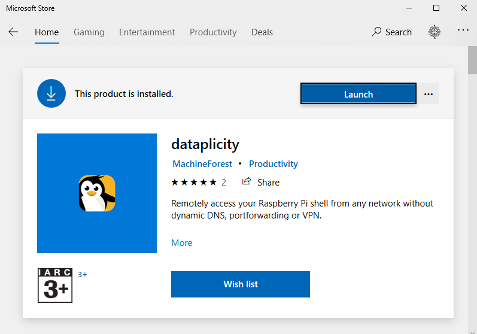

# **Raspberry PI setup**

## **Contents**

- [Hardware](#Hardware)
- [SD Card](#SD-Card)
- [Setup nginx and php](#Setup-nginx-and-php)
  - [Install](#Install)
  - [Test nginx](#Test-nginx)
  - [Make nginx restart if it crashes](#Make-nginx-restart-if-it-crashes)
  - [Test php](#Test-php)
- [Setup Dataplicity](#Setup-Dataplicity)
- [Internet](#Internet)
- [Code files](#Code-files)
  - [Listing of wwwRP.py](#Listing-of-wwwRP_py)
  - [Listing of index.php](#Listing-of-index_php)
- [Configuration](#Configuration)
- [Backup](#Backup)

## **Hardware**


The goal is to launch a python script on reboot of the Raspberry PI and have the script restart if it crashes. We are using a Raspberry PI 3A+ and run all scripts using Python 3 which we assume has been installed.

Raspberry PI 3A+. We are using this version since it uses less power, is cheaper, has a smaller form factor but has wifi and the one USB port is sufficient.

It is powered by 5.2V and when in production the one USB connection is used to power the Arduino Leonardo board. Apart from these and the Raspberry PI camera the only other connections are to 4 GPIO pins.

* GPIO 1 - 3.3V
* GPIO 6 - GROUND
* GPIO 8 - UART TXD
* GPIO 10 - UART RXD

Their only purpose is to setup bidirectional serial communications to the Arduino.

By explicit design there are no sensors (apart from the camera) attached directly to the Raspberry PI. Its "only" purpose is to interface to the world via a website interface, ask the Arduino for sensor readings as well as act on its behalf and also store collected data.

In the following sections we detail precisely how to add and configure all the software that is needed on this Raspberry PI. Once completed we will have an SD card that boots to the intended IOT environment.

## **SD Card**

Go to <https://www.raspberrypi.org/downloads> and download the Raspberry PI imager (for Windows).

With a 32GB micro SD Card and adaptor attached to your Windows 10 PC select the RASPBERRY PI OS (32BIT) option and then the above SD card. Finally press WRITE and wait.


* You can now put the SD card into your Raspberry PI. Have a dongle for bluetooth keyboard and mouse. Also a HDMI monitor plugged in:
  * Follow prompts on first boot.
  * Change password to: RPIPWD
  * Select WiFi Network: WIFISSID, Password: WIFIPWD
  * Make sure wifi working to enable software update - takes ages!
  * Restart when requested.
* In a terminal window type
  * sudo apt update
  * sudo apt install python3 idle3
    * as at 30/09/2020 this installs Python 3.7.3 with IDLE 3.7.3 and Tk 8.6.9.
    * This information is available in the GUI from the Application Menu => Programming => Python 3 (IDLE) => Help => About IDLE
* Set Raspberry Pi Configuration, only changing:
  * System => Hostname: HOSTNAME
  * Interfaces Enable: **Camera, SSH, I2C, Serial Port, Remote GPIO**

## **Setup nginx and php**

### **Install**

* cd /
* pip3 --version (just for information)
* sudo apt-get update
* sudo apt-get install nginx
* sudo /etc/init.d/nginx start
* sudo netstat -an | grep LISTEN | grep :80
  * This checks that a service is listening on port 80. It should show something like:

* sudo service nginx restart (It doesn't hurt)
* sudo apt install php-fpm
* cd /etc/nginx
* sudo nano sites-enabled/default
  * Find the line `index index.html index.htm;`
  * Add `index.php` after `index` in above line
  * Find the line `#location ~ \.php$ {`
  * and add the following lines or remove # till the next "}"
	```
	include snippets/fastcgi-php.conf;
	fastcgi_pass unix:/var/run/php/php7.3-fpm.sock;
	```
  * It should look like
	```
	location ~ \.php$ {
		include snippets/fastcgi-php.conf;
		fastcgi_pass unix:/var/run/php/php7.3-fpm.sock;
		}
	```
   * Save the above edited file and reload
     * sudo /etc/init.d/nginx reload

### **Test nginx**

  * find the address on the Raspberry PI
    * hostname -I
  * it will give you something like 192.168.0.12
  * type <http://192.168.0.12> in the browser of another PC attached to the local network:


### **Make nginx restart if it crashes**

  * Go to /lib/systemd/system and backup the nginx systemd unit (just in case)
    * cd /
    * cd /lib/systemd/system
    * sudo cp nginx.service nginx.service.old
  * Add the following 2 lines at the end of the [Service] block of nginx.service
	```
	Restart=on-failure
	RestartSec=9s
	```
    * Do this by typing: sudo nano nginx.service
    * Save the edited nginx.service file: Ctrl-X, Y, Enter.
  * load the new config:
    * sudo systemctl daemon-reload
  * To test kill nginx:
    * cd /
    * cd var/run
    * cat nginx.pid (will give you the PID)
    * sudo kill -9 PID
    * The nginx process will restart with a different PID (as can be viewed through the Task Manager or type "cat nginx.pid" again)

### **Test php**

  * cd /
  * cd var/www/html
  * sudo chmod o+w /var/www/html (to enable copying into this folder for later)
  * sudo nano index.nginx-debian.html (being the default web page)
  * Add the below lines just above the body tag:
	```
    <?php
      phpinfo();
    ?>
	```
  * Save the file as index.php
  * View <http://192.168.0.12> again


## **Setup Dataplicity**

Dataplicity is necessary so that the web server residing on the Raspberry Pi will be accessible from anywhere in the world with an arbitrary modern browser. This enables the Raspberry Pi to be a node in my IOT. Dataplicity is a sort of VPN service.

On an arbitrary PC (eg. Win10) with an arbitrary browser open
<https://www.dataplicity.com> and if not already done so setup account. You will need:

* An email address - say - SOMEADDRESS@gmail.com
* A password - say - DATAPLICITYPWD
* Also setup your preferred DATAPLICITYNAME.

This webpage is now your window to dataplicity. But you can also access its functionality with a Windows 10 app downloaded from the Microsoft Store:



You will need to install the Dataplicity agent by running the following on your Raspberry Pi terminal:


Once this has been done the Raspberry Pi should appear on the "Your Devices" menu above, as shown below:


We need to upgrade the Dataplicity Service:
Press the Settings Icon:


To see:


Press "Update settings" and "Profile" above to see:


Select "Subscription" and choose the PRO plan. Also go to "Billing" and "Settings" and update/setup as necessary.

To be able to SSH into the Raspberry PI select the device and on the Dataplicity terminal type:

* su pi
* RPIPWD (the Raspberry PI password)


Assuming you open Dataplicity in the browser and **NOT** the app select


To display:


To enable the Raspberry PI website select the Wormhole slider and edit the website name to the extent possible:


This determines the name of where the Raspberry PI an be reached from the wolrd wide web. In this case <https://DATAPLICITYNAME-device.dataplicity.io>

## **Internet**

The Raspberry Pi is intended to be used offsite with a wifi dongle. The dongle is assumed to be constantly on by default with the connection automatically reestablished on reboot.

From the GUI select and setup the connection to the dongle.

In the console you can see the connection by typing iwconfig.


You can confirm that your wifi settings are in the config file by typing in the console:

* sudo nano /etc/wpa_supplicant/wpa_supplicant.conf

which displays:


If there are problems delete the ```.wpa_supplicant.conf.swp``` hidden file from that directory. You can see and delete it by typing:

* cd /
* cd etc/wpa_supplicant
* ls -a
* sudo rm .wpa_supplicant.conf.swp

then if required to view and/or modify wpa_supplicant.conf:

* sudo nano /etc/wpa_supplicant/wpa_supplicant.conf

Finally setup your Raspberry PI to boot into the command line shell, via the GUI Raspberry PI Configuration menu.

If you then want to use the GUI temporarily (between reboots) type:

* startx

## **Code files**

Up to this point we have configured the Raspberry Pi basically as we want it for the IOT weather station. Additional custom scripts, python code and php scripts are necessary to complete the setup together with any permissions/setups.

These files will need to be loaded onto the Raspberry PI into three particular directories. One of these directories does not natively exist and must be created:

* cd /
* cd home/pi
* mkdir roman (or your own name)

All the files are listed here with their required directories and will be explained and/or setup in the following sections. You can download them now with the supplied links if you are using Git from the Raspberry PI or any other method like a USB stick or WinSCP from a Windows 10 PC.

When copying index.php you might need to first delete the already existing file with the same name. This will prevent problems with permissions if using WinSCP.

For interest, the listings of the main files **wwwRP.py** and **index.php** are shown below the following table.

| File | Directory | Description |
| --- | --- | --- |
| [launcher.sh](data/launcher.sh) | home/pi | script that runs on reboot |
| [forever.py](data/forever.py) | home/pi/roman | never stopping python script |
| [wwwRP.py](data/wwwRP.py) | home/pi/roman | main python script always restarts after crash |
| [reboot.sh](data/reboot.sh) | home/pi/roman | script that forces reboot |
| [take_photo_arg.sh](data/take_photo_arg.sh) | home/pi/roman | script that takes photo |
| [cputemp.sh](data/cputemp.sh) | home/pi/roman | measures CPU temperature |
| [led0_off.sh](data/led0_off.sh) | home/pi/roman | turns off led0 - to reduce light from IOT |
| [led1_off.sh](data/led1_off.sh) | home/pi/roman | turns off led1 - to reduce light from IOT |
| [led0_heartbeat.sh](data/led0_heartbeat.sh) | home/pi/roman | heartbeat flashes onboard led0 - for fun |
| [led1_heartbeat.sh](data/led1_heartbeat.sh) | home/pi/roman | heartbeat flashes onboard led1 - for fun|
| [led0_timer_500.sh](data/led0_timer_500.sh) | home/pi/roman | flashes onboard led0 for 0.5 sec - for fun|
| [led1_timer_500.sh](data/led1_timer_500.sh) | home/pi/roman | flashes onboard led1 for 0.5 sec - for fun|
| [numbers_solution.sh](data/numbers_solution.sh) | home/pi/roman | script for running numbers game program - for fun |
| [numc.cxx](data/numc.cxx) | home/pi/roman | C source code for numbers game program - for fun |
| [numc](data/numc) | home/pi/roman | executable for numbers game program - for fun |
| [index.php](data/index.php) | var/www/html | php file that exposes the Raspberry PI to the www |
| [LDG.jpg](data/LDG.jpg) | var/www/html | just a photo that the website can display - for fun |
| [wwwRP_basic.py](data/wwwRP_basic.py) | home/pi/roman | Raspberry PI only test version of wwwRP.py |
| [index_basic.php](data/index_basic.php) | var/www/html | Raspberry PI only test version of index.py |

### **Listing of wwwRPpy**

```python
#!/usr/bin/python3
import serial
import io
import time
import datetime
import codecs
import subprocess
import csv
import filecmp
import shutil


k=0
#setup serial connection to Arduino
ser = serial.Serial('/dev/ttyS0',4800,timeout=2.0)
bSerial = False


# Runs a shell script *.sh assumed to reside in home/pi/roman and having been
# made executable. First line is assumed to be #!/bin/bash
# no arguments
def RunShellScript(ScriptFile):
    cmd=['sh', '/home/pi/roman/'+ScriptFile+'.sh']
    proc = subprocess.Popen(cmd,stdout=subprocess.PIPE, stderr=subprocess.PIPE)
    o,e = proc.communicate()
    outstr = o.decode('ascii')
    errstr = e.decode('ascii')
    retstr = str(proc.returncode)
    print ('Output: '+outstr)
    print ('Error: '+errstr)
    print ('code: '+retstr)
    return outstr


# Runs a shell script *.sh assumed to reside in home/pi/roman and having been
# made executable. First line is assumed to be #!/bin/bash
# 3 arguments
def RunShellScript_arg(ScriptFile,arg1,arg2,arg3):
    print(arg1,arg2,arg3)
    cmd=['sh', '/home/pi/roman/'+ScriptFile+'.sh',str(arg1),str(arg2),str(arg3)]
    proc = subprocess.Popen(cmd,stdout=subprocess.PIPE, stderr=subprocess.PIPE)
    o,e = proc.communicate()
    outstr = o.decode('ascii')
    errstr = e.decode('ascii')
    retstr = str(proc.returncode)
    print ('Output: '+outstr)
    print ('Error: '+errstr)
    print ('code: '+retstr)
    return outstr


# Runs a shell script *.sh assumed to reside in home/pi/roman and having been
# made executable. First line is assumed to be #!/bin/bash
# 7 arguments
def RunShellScript_arg7(ScriptFile,arg1,arg2,arg3,arg4,arg5,arg6,arg7):
    print(arg1,arg2,arg3,arg4,arg5,arg6,arg7)
    cmd=['sh', '/home/pi/roman/'+ScriptFile+'.sh',str(arg1),str(arg2),str(arg3),str(arg4),str(arg5),str(arg6),str(arg7)]
    proc = subprocess.Popen(cmd,stdout=subprocess.PIPE, stderr=subprocess.PIPE)
    o,e = proc.communicate()
    outstr = o.decode('ascii')
    errstr = e.decode('ascii')
    retstr = str(proc.returncode)
    print ('Output: '+outstr)
    print ('Error: '+errstr)
    print ('code: '+retstr)
    return outstr


# Returns start time - EXPAND LATER
def CollectDataStartTime(minGap):
    # assume min gap dvides 60 minutes in hour ie is (1,2,4,5,6,10,12,15,20,30,60)
    dtn = datetime.datetime.now()
    dtny = dtn.year
    dtnm = dtn.month
    dtnd = dtn.day
    dtnh = dtn.hour
    dtnmi = dtn.minute

    # largest integer number of minGap's that are less than dtnmi
    sm = (dtnmi//minGap)*minGap
    print(sm)

    ist = datetime.datetime(dtny,dtnm,dtnd,dtnh,sm)
    dtd = datetime.timedelta(days=0,hours=0,minutes=minGap)
    ist = ist+dtd

    print(ist.strftime('%d-%b-%Y %H:%M:%S'))
    return ist


# Returns start time 2 - EXPAND LATER
def CollectDataStartTime2(hourGap):
    dtn = datetime.datetime.now()
    dtny = dtn.year
    dtnm = dtn.month
    dtnd = dtn.day
    dtnh = dtn.hour
    dtnmi = dtn.minute

    # largest integer number of hourGap's that are less than dtnh
    sm = (dtnh//hourGap)*hourGap
    print(sm)

    ist = datetime.datetime(dtny,dtnm,dtnd,sm,0)
    dtd = datetime.timedelta(days=0,hours=hourGap,minutes=0)
    ist = ist+dtd

    print(ist.strftime('%d-%b-%Y %H:%M:%S'))
    return ist


n=0
n2=0

# gap in minutes between data collection events (assume 60 % minGap == 0)
minGap = 15
hourGap = 24

# data collection time gap
dtd = datetime.timedelta(days=0,hours=0,minutes=minGap,seconds=0)

# action repeat time gap 2
dtd2 = datetime.timedelta(days=0,hours=hourGap,minutes=0,seconds=0)

# initial future time at which we will start collecting data
actTime = CollectDataStartTime(minGap)

# initial future time at which we will start repeating action
actTime2 = CollectDataStartTime2(hourGap)

# when first started do this to avoid spurious client command
shutil.copyfile('/var/tmp/text.txt','/var/tmp/text_bak.txt')

# wifi power flag (0=off, 1=on) and related variables
wifipower = 1 # default is wifi power ON
OFF_hr, OFF_min = 8, 1 # hour & min of day when wifi power is turned off
ON_hr, ON_min = 20, 1 # hour & min of day when wifi power is turned back on
powerOFFtime = datetime.time(OFF_hr,OFF_min,0,0)
powerONtime = datetime.time(ON_hr,ON_min,0,0)

# variables related to turining the wifi dongle off and then back on automatically after a set time.
wifiTimeOFF = 5 # default time in minutes for which wifi will be turned off.
dtd3 = datetime.timedelta(days=0,hours=0,minutes=wifiTimeOFF,seconds=10)
wifiTURN_ON = False # default state is that we do not want to turn the wifi on
WIFIactTime = actTime # just for initialisation


try:
    while True:
        dtn = datetime.datetime.now()
        dtns = dtn.strftime('%d%b%Y-%H:%M:%S')
        tx = dtn.strftime('%H%M%S')+"\r\n"
        dtnt = dtn.time() # the time of now (ignores date)

        # action wifi charging management
        if ((wifipower==1) and (dtnt > powerOFFtime) and (dtnt <= powerONtime)):
            # turn wifi power OFF
            while bSerial:
                time.sleep(1.0)
            bSerial = True
            ser.write(b'y')
            bSerial = False
            wifipower=0
        elif ((wifipower==0) and (dtnt > powerONtime)):
            # turn wifi power ON
            while bSerial:
                time.sleep(1.0)
            bSerial = True
            ser.write(b'x')
            bSerial = False
            wifipower=1

        # turn wifi on as required at WIFIactTime (which is wifiTimeOFF minutes + 10 seconds after it was turned off)
        if ((dtn >= WIFIactTime) and wifiTURN_ON):
            while bSerial:
                time.sleep(1.0)
            bSerial = True
            ser.write(b's')
            msg = "Pressed the wifi dongle button for 6 seconds"
            print(msg)
            bSerial = False
            wifiTURN_ON = False

        # do data collection stuff in main loop every minGap minutes
        if dtn >= actTime:
            n=n+1
            ats = actTime.strftime('%d-%b-%Y %H:%M:%S')
            print(" ")
            print("MAIN LOOP =",n)
            print("at time =",ats)
            actTime = actTime + dtd

            # collect CPU temperature in C to 1dp
            shellscript = 'cputemp'
            outstr = RunShellScript(shellscript)
            tCPU = str('{:.1f}'.format(round(float(outstr.strip())/1000.0,1)))
            print(tCPU)
            print(" ")

            # collect temperature, pressure, humidity, rainfall, wind speed, wind direction,
            # current, Bus Voltage and power by sending serial message (char u) to Arduino Mega
            while bSerial:
                time.sleep(1.0)
            bSerial = True
            ser.write(b'u')
            time.sleep(4.0) # to give time for serial reply from Arduino
            te, pr, hu, rf, ws, wd, cu, bv, po = str(ser.read_until(b'\r\n'))[2:-5].split( )
            te = str('{:.1f}'.format(round(float(te),1))) # temperature in C 1dp
            pr = str('{:.1f}'.format(round(float(pr),1))) # pressure in hPa 1dp
            hu = str('{:.1f}'.format(round(float(hu),1))) # humidity in % 1dp
            rf = str('{:.1f}'.format(round(float(rf),1))) # rain in mm idp
            ws = str('{:.1f}'.format(round(float(ws),1))) # wind speed in km/hr 1dp
            wd = str('{:.1f}'.format(round(float(wd),1))) # wind direction in degrees 1dp
            cu = str('{:.3f}'.format(round(float(cu)/1000.0,3))) # current in A 3dp
            bv = str('{:.2f}'.format(round(float(bv)/1000.0,2))) # Bus Voltage in V 2dp
            po = str('{:.2f}'.format(round(float(po)/1000.0,2))) # power in W 2dp
            bSerial = False
            print(te,pr,hu,rf,ws,wd,cu,bv,po," ")

            # Append collected data to data file with a time stamp
            odf = open('/var/www/html/SensorData.csv','a',newline='')
            odw = csv.writer(odf)
            odw.writerow([ats,te,pr,hu,rf,ws,wd,tCPU,cu,bv,po])
            odf.close()
                
        # perform actions in main loop 2
        if dtn >= actTime2:
            n2=n2+1
            ats = actTime2.strftime('%d-%b-%Y %H:%M:%S')
            print(" ")
            print("MAIN LOOP2 =",n2)
            print("at time =",ats)
            actTime2 = actTime2 + dtd2

            # press the wifi dongle button for 6 seconds.
            while bSerial:
                time.sleep(1.0)
            bSerial = True
            ser.write(b's')
            bSerial = False
            msg = "Pressed the wifi dongle button for 6 seconds"
            print(msg," ")

        # see if text.txt file has changed compared to text_bak.txt
        bSame = filecmp.cmp('/var/tmp/text.txt','/var/tmp/text_bak.txt')
        if not bSame:
            print('Received Command from client')

            # parse contents of text.txt file
            f = open('/var/tmp/text.txt',"r")
            msgs = str(f.read())
            sBody = msgs[6:]
            sBodyArg = sBody.split()
            print(dtns)
            print(sBody)
            print(sBodyArg)
            print(len(sBodyArg))
            f.close()

            # make text_bak same as text in preperation for next command
            shutil.copyfile('/var/tmp/text.txt','/var/tmp/text_bak.txt')

            # act on command from text.txt file
            try:
                if (sBodyArg[0] == 'help'):
                    # meaning: show help
                    f = open('/var/tmp/result.txt','w')
                    f.writelines([tx,"\r\n",
                                     "Note: All inputs are NOT case sensitive\r\n",
                                     "help - display this help\r\n",
                                     "gd - enable link to current sensor data file\r\n",
                                     "LDG - display photo of Lidia Duda-Groblicka in her home studio\r\n",
                                     "PHP - display results of phpinfo() php command\r\n",
                                     "gp - redisplay last photo taken\r\n",
                                     "tp [arg1,arg2,arg3] - take photo with or without 3 parameters\r\n",
                                     "---> arg1 = QUALITY [1,100], arg2 = WIDTH pixels, arg3 = HEIGHT pixels\r\n",                                 
                                     "ma - MEASURE ALL sensor data\r\n",
                                     "cp - measure current CPU temperature in Centigrade\r\n",
                                     "fl arg1 - flash Arduino onboard led arg1 (within [0,9]) times\r\n",
                                     "ra - Reset/reboot Arduino\r\n",
                                     "st - Test the serial Raspberry PI to Arduino link\r\n",
                                     "pb - Press the wifi dongle button for 6 seconds (for testing servo)\r\n",
                                     "rw - Press the wifi dongle button for 10 seconds to turn it off\r\n",
                                     "---> and then turn it back on in 5 minutes\r\n", 
                                     "sh arg1 - run shell script named arg1 with no arguments\r\n",
                                     "---> reboot\r\n"
                                     "---> with @ = 0 or 1 have scripts\r\n",
                                     "-----> led@_heartbeat\r\n",
                                     "-----> led@_off\r\n",
                                     "-----> led@_on\r\n",
                                     "-----> led@_timer\r\n",
                                     "-----> led@_timer_100\r\n",
                                     "-----> led@_timer_500\r\n",
                                     "-----> led@_timer_2000\r\n",
                                     "pn arg1...arg7- find 1st solution (if any) to numbers game (from Letters & Numbers TV show)\r\n",
                                     "---> arg1 to arg6 are the six used numbers, while arg7 is the sought for solution\r\n",                                     
                                     "dr arg1 - set digital relay off (arg1=o) or on (arg1=-)\r\n"
                                  ])
                    f.close()

                elif (sBodyArg[0] == 'gd'):
                    # meaning: enable link to current sensor data file
                    f = open('/var/tmp/result.txt','w')
                    f.writelines([tx,"Download link to "])
                    f.close()

                elif (sBodyArg[0].upper() == 'LDG'):
                    # meaning: display photo of Lidia Duda-Groblicka in her home studio
                    # the client will be able to download it from the website

                    f = open('/var/tmp/result.txt','w')
                    f.writelines([tx,"Photo of Lidia Duda-Groblicka in studio"])
                    f.close()

                elif (sBodyArg[0].upper() == 'PHP'):
                    # meaning: display results of phpinfo() php command

                    f = open('/var/tmp/result.txt','w')
                    f.writelines([tx,"phpinfo()"])
                    f.close()

                elif (sBodyArg[0] == 'gp'):
                    # meaning: redisplay last photo taken
                    f = open('/var/tmp/result.txt','w')
                    f.writelines([tx,"Display last photo taken"])
                    f.close()

                elif (sBodyArg[0] == 'tp'):
                    # meaning: take photo with or without parameters
                    # the client will be able to download it from the website

                    #run script which takes photo
                    shellscript = 'take_photo_arg'

                    if len(sBodyArg)!=4:
                        #if there are not 3 arguments (not including script name) then just assign default values
                        outstr = RunShellScript_arg(shellscript,75,1024,768)
                    else:
                        # 3 parameters as required by shell script
                        outstr = RunShellScript_arg(shellscript,sBodyArg[1],sBodyArg[2],sBodyArg[3])

                    f = open('/var/tmp/result.txt','w')
                    f.writelines([tx,"Took photo"])
                    f.close()

                elif (sBodyArg[0] == 'ma'):
                    # meaning: measure temperature, pressure, humidity,
                    # rainfall, windspeed, wind direction, current,
                    # voltage and power used by this IOT unit and send it back
                    # to client as text
                    # send serial message (char u) to Arduino Mega

                    while bSerial:
                        time.sleep(2.0)
                    bSerial = True
                    ser.write(b'u')
                    time.sleep(4.0) # to give time for serial reply from Arduino
                    te, pr, hu, rf, ws, wd, cu, bv, po = str(ser.read_until(b'\r\n'))[2:-5].split( )
                    te = str('{:.1f}'.format(round(float(te),1))) # temperature in C 1dp
                    pr = str('{:.1f}'.format(round(float(pr),1))) # pressure in hPa 1dp
                    hu = str('{:.1f}'.format(round(float(hu),1))) # humidity in % 1dp
                    rf = str('{:.1f}'.format(round(float(rf),1))) # rain in mm idp
                    ws = str('{:.1f}'.format(round(float(ws),1))) # wind speed in km/hr 1dp
                    wd = str('{:.1f}'.format(round(float(wd),1))) # wind direction in degrees 1dp
                    cu = str('{:.3f}'.format(round(float(cu)/1000.0,3))) # current in A 3dp
                    bv = str('{:.2f}'.format(round(float(bv)/1000.0,2))) # Bus Voltage in V 2dp
                    po = str('{:.2f}'.format(round(float(po)/1000.0,2))) # power in W 2dp
                    bSerial = False
                    print(te,pr,hu,rf,ws,wd,cu,bv,po," ")

                    f = open('/var/tmp/result.txt','w')
                    f.writelines([tx,"Temperature (C):         "+te,"\r\n",
                                     "Pressure (hPa):          "+pr,"\r\n",
                                     "Humidity (%):            "+hu,"\r\n",
                                     "Rainfall (mm):           "+rf,"\r\n",
                                     "Wind speed (km/hr):      "+ws,"\r\n",
                                     "Wind direction (degrees):"+wd,"\r\n",
                                     "Current (A):             "+cu,"\r\n",
                                     "Bus Voltage (V):         "+bv,"\r\n",
                                     "Power (W):               "+po,"\r\n"])
                    
                    f.close()

                elif (sBodyArg[0] == 'cp'):
                    # meaning: measure current CPU temperature in Centigrade and send it back to client as text

                    # collect CPU temperature via running special script
                    shellscript = 'cputemp'
                    outstr = RunShellScript(shellscript)
                    tCPU = str('{:.1f}'.format(round(float(outstr.strip())/1000.0,1)))

                    f = open('/var/tmp/result.txt','w')
                    f.writelines([tx,"CPU Temperature (C): "+tCPU])
                    f.close()

                elif (sBodyArg[0] == 'fl'):
                    # meaning: flash RPi onboard led sBodyArg[1] (within [2,9]) times
                    print('Flash Led')
                    print(sBodyArg[1])

                    while bSerial:
                        time.sleep(1.0)
                    bSerial = True
                    ser.write(b'f'+sBodyArg[1].encode())
                    bSerial = False

                    f = open('/var/tmp/result.txt','w')
                    f.writelines([tx,"Flashed Arduino onboard led "+sBodyArg[1]+" times"])
                    f.close()

                elif (sBodyArg[0] == 'sh'):
                    # run shell script with name sBodyArg[1] and no arguments
                    print('Run script')
                    print(sBodyArg[0])
                    RunShellScript(sBodyArg[1])

                    f = open('/var/tmp/result.txt','w')
                    f.writelines([tx,"Ran RPi shell script "+sBodyArg[1]+".sh"])
                    f.close()

                elif (sBodyArg[0] == 'pn'):
                    # meaning: find 1st solution (if any) to numbers game (from Letters & Numbers TV show)
                    # the client will see 1st solution on website

                    #run script which searches for solution
                    shellscript = 'numbers_solution'

                    if len(sBodyArg)!=8:
                        #if there are not 7 arguments (not including script name) then just assign default values
                        outstr = RunShellScript_arg7(shellscript,100,75,50,25,10,3,666)
                    else:
                        # 7 parameters as required by shell script
                        outstr = RunShellScript_arg7(shellscript,sBodyArg[1],sBodyArg[2],sBodyArg[3],sBodyArg[4],sBodyArg[5],sBodyArg[6],sBodyArg[7])
                    print(outstr)

                    f = open('/var/tmp/result.txt','w')
                    f.writelines([tx,outstr])
                    f.close()

                elif (sBodyArg[0] == 'dr'):
                    # meaning: set digital relay off or on. "dr o" or "dr -".

                    while bSerial:
                        time.sleep(1.0)
                    bSerial = True
                    f = open('/var/tmp/result.txt','w')
                    sa = sBodyArg[1] # switch argument: o or -
                    if sa == 'o':
                        ser.write(b'y')
                        #wifipower=0
                        msg = "WIFI dongle power OFF"
                    elif sa == '-':
                        ser.write(b'x')
                        #wifipower=1
                        msg = "WIFI dongle power ON"
                    else:
                        msg = "Invalid arguments"
                    print(msg)
                    bSerial = False

                    f.writelines([tx,msg])
                    f.close()

                elif (sBodyArg[0] == 'ra'):
                    # meaning: reboot/reset the Arduino.

                    while bSerial:
                        time.sleep(1.0)
                    bSerial = True
                    f = open('/var/tmp/result.txt','w')
                    ser.write(b'z')
                    msg = "Rebooted/Reset Arduino"
                    print(msg)
                    bSerial = False

                    f.writelines([tx,msg])
                    f.close()

                elif (sBodyArg[0] == 'pb'):
                    # meaning: press the wifi dongle button for 6 seconds.

                    while bSerial:
                        time.sleep(1.0)
                    bSerial = True
                    f = open('/var/tmp/result.txt','w')
                    ser.write(b's')
                    msg = "Pressed the wifi dongle button for 6 seconds"
                    print(msg)
                    bSerial = False

                    f.writelines([tx,msg])
                    f.close()

                elif (sBodyArg[0] == 'st'):
                    # meaning: a serial message test from RPI test to Arduino 

                    while bSerial:
                        time.sleep(1.0)
                    bSerial = True
                    ser.write(b'abcdefghijklmnopabcdefghijklmnopabcdefghijklmnop')
                    time.sleep(1)
                    msg = str(ser.read_until(b'\r\n'))[2:-5]
                    print(msg)
                    bSerial = False

                    f = open('/var/tmp/result.txt','w')
                    f.writelines([tx,msg])
                    f.close()

                elif (sBodyArg[0] == 'rw'):
                    # meaning: press the wifi dongle button for 10 seconds to switch it off and then
                    # after a short time (dtd3) switch it on again (in different code)

                    while bSerial:
                        time.sleep(1.0)
                    bSerial = True
                    # f = open('/var/tmp/result.txt','w')
                    ser.write(b'q')
                    msg = "Pressed the wifi dongle button for 10 seconds"
                    print(msg)
                    bSerial = False

                    WIFIactTime = datetime.datetime.now() + dtd3
                    wifiTURN_ON = True # set flag signifying that wifi needs to be turned on (in this loop)

                    #f.writelines([tx,msg])
                    #f.close()

                else:
                    # Not an actionable command
                    print('Non actionable command')

                    f = open('/var/tmp/result.txt','w')
                    f.writelines([tx,"Does nothing"])
                    f.close()

            except IndexError:
                # "Blank" command sent
                print('No command sent')

                f = open('/var/tmp/result.txt','w')
                f.writelines([tx,"No command sent"])
                f.close()

except KeyboardInterrupt:
    k = k+1
```

### **Listing of indexphp**

```php
<!DOCTYPE html>
<html>

<head>

<title>RMG IOT</title>

<meta name="viewport" content="width=device-width, initial-scale=1.0">

<style>
html {
    font-family:"LucindaSans", sans-serif:
    }

.header {
    background-color: #9933cc;
    color: #ffffff;
    padding: 3px;
    }

.center {
    display: block;
    margin-left: auto;
    margin-right: auto;
    width: 98%;
    }

.footer {
    background-color: $0099cc;
    color: #ffffff;
    text-align: center;
    font-size: 20x;
    padding: 3px;
    }

h1 {
    margin-top: 5px;
    margin-bottom: 5px;
    margin-left: 5px;
    }

* {
    box-sizing: border-box;
    }

.row::after {
    content: "";
    clear: both;
    display: table;
    }

[class*="col-"] {
    float: left;
    padding: 3px;
    width: 100%;
}

@media screen and (orientation:portrait){
    body {
        margin: 1em;
        font-family: Tahoma, Verdana, Arial, sans-serif;
        background-color: lightgray;
    }
    .col-s-1 {width: 50%;}
    .col-s-2 {width: 100%;}
}

@media screen and (orientation:landscape){
    body {
        margin: 1em;
        font-family: Tahoma, Verdana, Arial, sans-serif;
	background-color: white;
    }
    .col-1 {width: 50%;}
    .col-2 {width: 100%;}
}

</style>
</head>

<body>

<div class="header">
    <h1> Raspberry Pi IOT interface </h1>
</div>

<div class="row">

    <div class="col-1 col-s-1">
        <br>
	<form action="#" method="post">
		Command:
		<input type="text" name="cmd" autofocus/>
		<input type="submit" value="SUBMIT" />
	</form>
	<br>

<?php
    $input = strtolower($_POST['cmd']);

    echo "The cmd you sent is: <br />\n";
    echo $input, "<br /><br />\n";
    $timeID = date("His");
    $regrec = implode(", ", $_POST);
    $finalrec = strtolower($timeID . $regrec);

    // Read 1st line of current result file
    $myresult1 = fopen("/var/tmp/result.txt","r");
    $result1 = fgets($myresult1);
    fclose($myresult1);

    $fp = fopen("/var/tmp/text.txt","w");
    if (fwrite($fp,$finalrec) == FALSE) {
	    echo "Cannot write file.", "<br />\n";
    }
    else {
        // keep waiting until result.txt file changes, which means results
        // are ready to be viewed on this webpage
       do {
           sleep(1);    
           // Read 1st line of current result file
           $myresult2 = fopen("/var/tmp/result.txt","r");
           $result2 = fgets($myresult2);
           fclose($myresult2);
        } while (strcmp($result1,$result2)==0);    

        echo "The Result is:", "<br /> \n";
        $myresult = fopen("/var/tmp/result.txt","r");
        fgets($myresult);
        while(! feof($myresult)) {  
            echo fgets($myresult),"<br />";
	    }
	    fclose($myresult);
    }
    fclose($fp);

   echo '</div>';
   echo '<div class="col-1 col-s-2">';
   sleep(2);
    if (substr($input,0,2)=="tp"){
        // display photo if "take photo" command starting with "tp" was sent to server (it might have more arguments)
	    echo '<p> </p>';}
    elseif (substr($input,0,2)=="gp"){
        // display photo if "get photo" command starting with "gp" was sent to server (it might have more arguments)
	    echo '<p> </p>';}
    elseif (strtoupper(substr($input,0,3))=="LDG"){
        // display appropriate archive photo if command "LDG" was sent to server
	    echo '<p> </p>';}
    elseif (substr($input,0,2)=="gd"){
        // display link to appropriate file (for download) if command "gd" was sent to server
	    echo '<a href="SensorData.csv" download> sensor data</a>';}
    elseif (substr($input,0,3)=="php"){
        // display php info if command "php" was sent to server
	    phpinfo();}
    echo '</div>';
    echo '</div>';
?>

</body>
</html>
```

## **Configuration**

If the main Python code that controls the weather station crashes then interfacing the Raspberry PI is compromised. To mitigate this the launcher.sh script is run on reboot, this in turn runs forever.py which will call the main python code wwwRP.py and restart it if the latter crashes. Various setups detailed below need to be performed on these.

To setup launcher.sh, type in the terminal:

* cd /
* cd home/pi
* sudo nano launcher.sh (displays below for interest:)
	```
	#!bin/sh
	cd /
	cd home/pi/roman
	python3 forever.py wwwRP.py
	cd /
	```
* Ctrl-X (to exit nano)

make this file executable

* cd /
* cd home/pi
* sudo chmod 0775 launcher.sh

and confirm the permissions

* cd /
* cd home/pi
* stat launcher.sh

To make launcher.sh run at reboot:

* sudo crontab -e

  run from any directory it opens crontab in nano where you must add the line:

	```
	@reboot sh /home/pi/launcher.sh >/home/pi/logs/cronlog 2>&1
	```

If it does not exist text is diplayed saying at start "no crontab for root" and gives options to select editor for later. Choose 1 for nano. This opens crontab where you can add above line, save and exit.

create the home/pi/logs directory:

* cd /
* cd home/pi
* mkdir logs

on reboot this directory will contain an updated cronlog file which can be examined thus:

* cd /
* cd home/pi/logs
* more cronlog

To have wwwRP.py run we need to create (touch) utility files with appropriate permissions:

* cd /
* cd var/tmp
* touch text.txt
* sudo chmod 0777 text.txt
* touch text_bak.txt
* sudo chmod 0777 text_bak.txt

For testing wwwRP.py you can comment out the above crontab line (with #) and reboot. You can then edit and/or run the script from the IDLE GUI but to retain appropriate permissions adjust the **Command:** line in the properties of the **Python3 (IDLE)** app to include sudo, ie to be:

* sudo /usr/bin/idle-python3.7

Start Idle with the Python 3.7.3 Shell from Programming => Python 3 (IDLE).
Open and edit/run the /home/pi/roman/wwwRP.py script.

**IMPORTANT :** Do not run wwwRP.py from IDLE when it is already running in the background through crontab. This will cause mysterious serial comm errors.

Finally to enable the (fun) numc executable type:

* cd /
* cd home/pi/roman
* sudo chmod 0777 numc

## **Backup**

As detailed above once we have an SD card that boots to the intended IOT environment it is helpfull to create an image so that if the SD card becomes corrupted it can be easily replaced.

On a Windows PC create an image file (*.img). Do this with the [**Win32 Disk Imager**](https://win32diskimager.download/) application. If the original SD card is corrupted this image can be used to recreate it on a new one. **Make sure that this new card is the same type as the original one**.

All this is pretty straight forward, but you can get an explanation [**HERE**](https://www.raspberrypi.org/documentation/installation/installing-images/windows.md) or a more detailed one [**HERE**](https://www.howtogeek.com/341944/how-to-clone-your-raspberry-pi-sd-card-for-foolproof-backup/).
