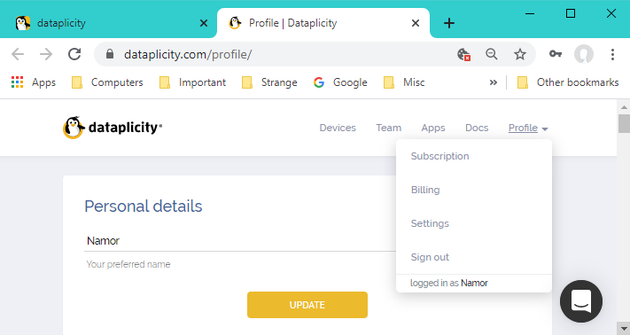

# **Raspberry PI**

The goal is to launch a python script on reboot of the Raspberry PI and have the script restart if it crashes.
We are using a Raspberry PI 3A+ and run all scripts using Python 3 which we assume has been installed.

## **Hardware**

Raspberry PI 3A+. We are using this version since it uses less power, is cheaper, has a smaller form factor but has wifi and the one USB port is sufficient.

It is powered by 5.2V and when in production the one USB connection is used to power the Arduino Leonardo board. Apart from the above the only connections are via 4 GPIO pins.

* GPIO 1 - 3.3V
* GPIO 6 - GROUND
* GPIO 8 - UART TXD
* GPIO 10 - UART RXD

Their only purpose is to setup bidirectional serial communications to the Arduino.

## **SD Card**

Go to https://www.raspberrypi.org/downloads/ and download the Raspberry PI imager (for Windows).

With a 32GB micro SD Card and adaptor attached to your Windows 10 PC select the RASPBERRY PI OS (32BIT) option and then the above SD card. Finally press WRITE and wait.

* You can now put the SD card into your Raspberry PI. Have a dongle for bluetooth keyboard and mouse. Also a HDMI monitor plugged in:
  * Follow prompts on first boot.
  * Change password to: RPIPWD
  * Select WiFi Network: WIFISSID, Password: WIFIPWD
  * Make sure wifi working to enable software update - takes ages!
  * Restart when requested.
* In a terminal window type
  * sudo apt update
  * sudo apt install python3 idle3
    * as at 30/09/2020 this installs Python 3.7.3 with IDLE 3.7.3 and Tk 8.6.9.
    * This information is available in the GUI from the Application Menu => Programming => Python 3 (IDLE) => Help => About IDLE
* Set Raspberry Pi Configuration, only changing:
  * System => Hostname: HOSTNAME
  * Interfaces Enable: **Camera, SSH, I2C, Serial Port, Remote GPIO**

[Hardware](#Hardware)

## **Install nginx & php**

* **install nginx & php, in a terminal window type:**

  * cd /
  * pip3 --version (just for information)
  * sudo apt-get update
  * sudo apt-get install nginx
  * sudo /etc/init.d/nginx start
  * sudo netstat -an | grep LISTEN | grep :80
    * This checks that a service is listening on port 80. It should show something like:

  * sudo service nginx restart (It doesn't hurt)
  * sudo apt install php-fpm
  * cd /etc/nginx
    * sudo nano sites-enabled/default
    * Find the line "index index.html index.htm;"
    * Add "index.php" after "index" in above line
    * Find the line "# location ~ \.php$ {"
    * and add the following lines or remove # till the next "}"

			include snippets/fastcgi-php.conf;
			fastcgi_pass unix:/var/run/php/php7.3-fpm.sock;

    * It should look like

			location ~ .php$ {
				include snippets/fastcgi-php.conf;
				fastcgi_pass unix:/var/run/php/php7.3-fpm.sock;
			}

    * Save the above edited file and reload
      * sudo /etc/init.d/nginx reload

* **To test the server:**

  * find the address on the Raspberry PI
    * hostname -I
  * it will give you something like 192.168.0.12
  * type http://192.168.0.12 in the browser of another PC attached to the local network:

* **To make nginx restart if it crashes non gracefully (it happens):**

  * Go to /lib/systemd/system and backup the nginx systemd unit (just in case)
    * cd /
    * cd /lib/systemd/system
    * sudo cp nginx.service nginx.service.old
  * Add the following 2 lines at the end of the [Service] block of nginx.service

				Restart=on-failure
				RestartSec=9s

    * Do this by typing: sudo nano nginx.service
    * Save the edited nginx.service file: Ctrl-X, Y, Enter.
  * load the new config:
    * sudo systemctl daemon-reload
  * To test kill nginx:
    * cd /
    * cd var/run
    * cat nginx.pid (will give you the PID)
    * sudo kill -9 PID
    * The nginx process will restart with a different PID (as can be viewed through the Task Manager or type "cat nginx.pid" again)

* **To test PHP**

  * cd /
  * cd var/www/html
  * sudo chmod o+w /var/www/html (to enable copying into this folder for later)
  * sudo nano index.nginx-debian.html (being the default web page)
  * Add the below lines just above the </body> tag:

			<?php
				phpinfo();
			?>

  * Save the file as index.php
  * View http://192.168.0.12 again

## **Setup Dataplicity:**

Dataplicity is necessary so that the web server residing on the Raspberry Pi will be accessible from anywhere in the world with an arbitrary modern browser. This enables the Raspberry Pi to be a node in my IOT. Dataplicity is a sort of VPN service.

On an arbitrary PC (eg. Win10) with an arbitrary browser open
https://www.dataplicity.com and if not already done so setup account. You will need:

* An email address - say - SOMEADDRESS@gmail.com
* A password - say - DATAPLICITYPWD
* Also setup your preferred DATAPLICITYNAME.

This webpage is now your window to dataplicity. But you can also access its functionality with a Windows 10 app downloaded from the Microsoft Store:

You will need to install the Dataplicity agent by running the following on your Raspberry Pi terminal:

Once this has been done the Raspberry Pi should appear on the "Your Devices" menu above, as shown below:

We need to upgrade the Dataplicity Service:
Press the Settings Icon:

To see:

Press "Update settings" and "Profile" above to see:

Select "Subscription" and choose the PRO plan. Also go to "Billing" and "Settings" and update/setup as necessary.

To be able to SSH into the Raspberry PI select the device and on the Dataplicity terminal type:

* su pi
* RPIPWD (the Raspberry PI password)

Assuming you open Dataplicity in the browser and **NOT** the app select

To display:

To enable the Raspberry PI website select the Wormhole slider and edit the website name to the extent possible:

This determines the name of where the Raspberry PI an be reached from the wolrd wide web. In this case https://DATAPLICITYNAME-device.dataplicity.io

## **Internet on the Raspberry PI**

The Raspberry Pi is intended to be used offsite with a wifi dongle. The dongle is assumed to be constantly on by default with the connection automatically reestablished on reboot.

From the GUI select and setup the connection to the dongle.

In the console you can see the connection by typing iwconfig.

You can confirm that your wifi settings are in the config file by typing in the console:

* sudo nano /etc/wpa_supplicant/wpa_supplicant.conf

which displays:

If there are problems delete the .wpa_supplicant.conf.swp hidden file from that directory. You can see and delete it by typing:

* cd /
* cd etc/wpa_supplicant
* ls -a
* sudo rm .wpa_supplicant.conf.swp

then if required to view and/or modify wpa_supplicant.conf:

* sudo nano /etc/wpa_supplicant/wpa_supplicant.conf

Finally setup your Raspberry PI to boot into the command line shell, via the GUI Raspberry PI Configuration menu.

If you then want to use the GUI temporarily (between reboots) type:

* startx

## **Code files**

Up to this point we have configured the Raspberry Pi basically as we want it for the IOT weather station. Additional custom scripts, python code and php scripts are necessary to complete the setup together with any permissions/setups.

These files will need to be loaded onto the Raspberry PI into three particular directories. One of these directories does not natively exist and must be created:

* cd /
* cd home/pi
* mkdir roman (or your own name)

All the files are listed here with their required directories and will be explained and/or setup in the following sections. You can download them now with the supplied links if you are using Git from the Raspberry PI or any other method like a USB stick or WinSCP from a Windows 10 PC.

| File | Directory | Description |
| --- | --- | --- |
| [launcher.sh](data/launcher.sh) | home/pi | script that runs on reboot |
| [forever.py](data/forever.py) | home/pi/roman | never stopping python script |
| [wwwRP.py](data/wwwRP.py) | home/pi/roman | main python script always restarts after crash |
| [reboot.sh](data/reboot.sh) | home/pi/roman | script that forces reboot |
| [take_photo_arg.sh](data/take_photo_arg.sh) | home/pi/roman | script that takes photo |
| [cputemp.sh](data/cputemp.sh) | home/pi/roman | measures CPU temperature |
| [led0_off.sh](data/led0_off.sh) | home/pi/roman | turns off led0 - to reduce light from IOT |
| [led1_off.sh](data/led1_off.sh) | home/pi/roman | turns off led1 - to reduce light from IOT |
| [led0_heartbeat.sh](data/led0_heartbeat.sh) | home/pi/roman | heartbeat flashes onboard led0 - for fun |
| [led1_heartbeat.sh](data/led1_heartbeat.sh) | home/pi/roman | heartbeat flashes onboard led1 - for fun|
| [led0_timer_500.sh](data/led0_timer_500.sh) | home/pi/roman | flashes onboard led0 for 0.5 sec - for fun|
| [led1_timer_500.sh](data/led1_timer_500.sh) | home/pi/roman | flashes onboard led1 for 0.5 sec - for fun|
| [numbers_solution.sh](data/numbers_solution.sh) | home/pi/roman | script for running numbers game program - for fun |
| [numc.cxx](data/numc.cxx) | home/pi/roman | C source code for numbers game program - for fun |
| [numc](data/numc) | home/pi/roman | executable for numbers game program - for fun |
| [index.php](data/index.php) | var/www/html | php file that exposes the Raspberry PI to the www |
| [LDG.jpg](data/LDG.jpg) | var/www/html | just a photo that the website can display - for fun |

## **The main rebooting script**

If the main Python code that controls the weather station crashes then interfacing the Raspberry PI is compromised. To mitigate this the launcher.sh script is run on reboot which restarts the main code as necessary.

home/pi/launcher.sh
#!bin/sh
cd /
cd home/pi/roman
python3 forever.py wwwRP.py
cd /

to edit it from the terminal type
	• cd /sudo 
	• cd home/pi
	• sudo nano launcher.sh

make this file executable from the terminal
	• cd /
	• cd home/pi
	• sudo chmod 0775 launcher.sh

and confirm the permissions
	• cd /
	• cd home/pi
	• stat launcher.sh
